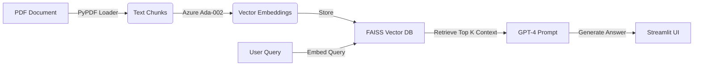

# 🧠 Enterprise Knowledge RAG Engine
### Secure Document Intelligence using Azure OpenAI & LangChain

---

## 🚀 Project Overview

In the consulting and industrial sectors, professionals spend up to **30% of their time** searching through massive PDF reports, compliance documents, and technical manuals.

This project is an **Enterprise-Grade Retrieval-Augmented Generation (RAG) System**. It allows users to securely "chat" with internal documents, extracting precise answers with source citations. Unlike public ChatGPT, this architecture ensures data stays within the organization's Azure perimeter, preventing data leakage.

### Key Capabilities:
*   **Context-Aware Answers:** Uses Vector Embeddings to find the exact paragraph needed to answer a query.
*   **Hallucination Reduction:** Restricts the AI to answer *only* based on the provided documents.
*   **Source Citations:** Returns the specific page number and source text for every answer (crucial for audit trails).

---

## 🏗️ System Architecture

The system follows a modern RAG pipeline:
1.  **Ingestion:** Python script loads PDFs and splits text into manageable chunks (recursive character splitting).
2.  **Embedding:** Chunks are converted into vector representations using **Azure OpenAI (text-embedding-ada-002)**.
3.  **Vector Store:** Vectors are stored locally using **FAISS** (Facebook AI Similarity Search) for millisecond-latency retrieval.
4.  **Retrieval & Generation:** The system retrieves top-k chunks and synthesizes an answer using **GPT-4**.

## Pipeline Steps:

Ingestion: Load PDFs and split text into manageable chunks (recursive character splitting).

Embedding: Convert chunks into vectors using Azure OpenAI (text-embedding-ada-002).

Vector Store: Store vectors locally in FAISS for millisecond-latency retrieval.

Retrieval & Generation:

User asks a question via Streamlit UI.

System retrieves top-k relevant chunks from FAISS.

GPT-4 (Azure) synthesizes an answer using only the retrieved context.

## 🛠️ Tech Stack

Language: Python 3.11

Orchestration: LangChain

LLM & Embeddings: Azure OpenAI Service (GPT-4 / text-embedding-ada-002)

Vector Database: FAISS (CPU)

Frontend: Streamlit

Utilities: PyPDF, python-dotenv

## ⚙️ Installation & Setup
1. Prerequisites

Python 3.10 or higher

Azure OpenAI resource with two deployments:

Embedding Model: text-embedding-ada-002

Chat Model: gpt-4 or gpt-35-turbo

2. Clone Repository
git clone https://github.com/YOUR_USERNAME/enterprise-rag-engine.git
cd enterprise-rag-engine

3. Virtual Environment
# Windows
python -m venv venv
venv\Scripts\activate

# Mac/Linux
python3 -m venv venv
source venv/bin/activate

4. Install Dependencies
pip install -r requirements.txt

5. Environment Configuration

Create a .env file in the root directory with your Azure credentials:

AZURE_OPENAI_API_KEY=your_key_here
AZURE_OPENAI_ENDPOINT=https://your-resource.openai.azure.com/
AZURE_OPENAI_API_VERSION=2023-05-15
AZURE_EMBEDDING_DEPLOYMENT_NAME=text-embedding-ada-002
AZURE_CHAT_DEPLOYMENT_NAME=gpt-4

## 🖥️ Usage

Run the Streamlit application:

streamlit run app.py

How to use:

Open the web interface (usually http://localhost:8501
)

Upload a PDF document via the sidebar

Click Process Document to generate embeddings (creates in-memory vector store)

Chat with your document in the main window

## 🔒 Security Note

Uses Azure OpenAI Service, unlike public OpenAI API:

Data is not used to train base models

Data privacy is maintained within your Azure subscription
